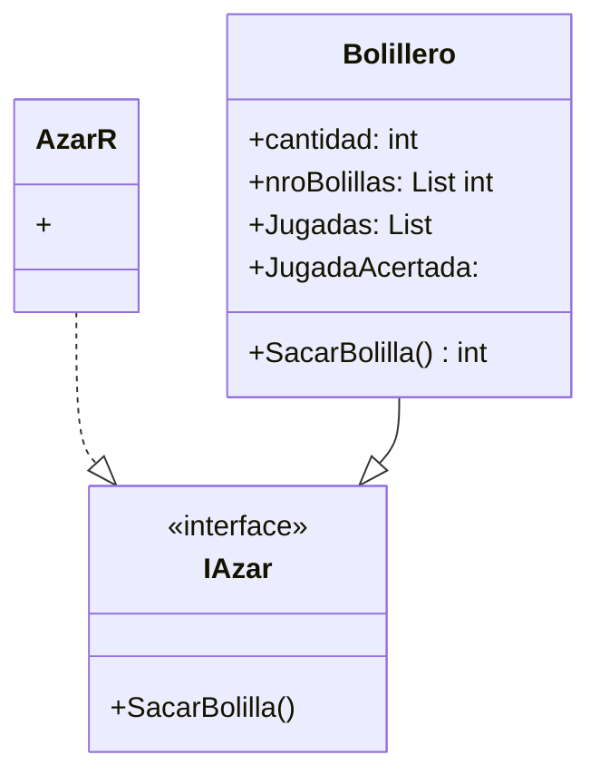

## Documentacion

```mermaid
classDiagram
    class Bolillero{
        +cantidad: int 
        +nroBolillas: List int
        +Jugadas: List
        +JugadaAcertada:
        +SacarBolilla() int
    }

    class IAzar{
        <<interface>>
        +SacarBolilla()
    }

    class AzarR{
        +
    }


AzarR ..|> IAzar
Bolillero --|> IAzar

```