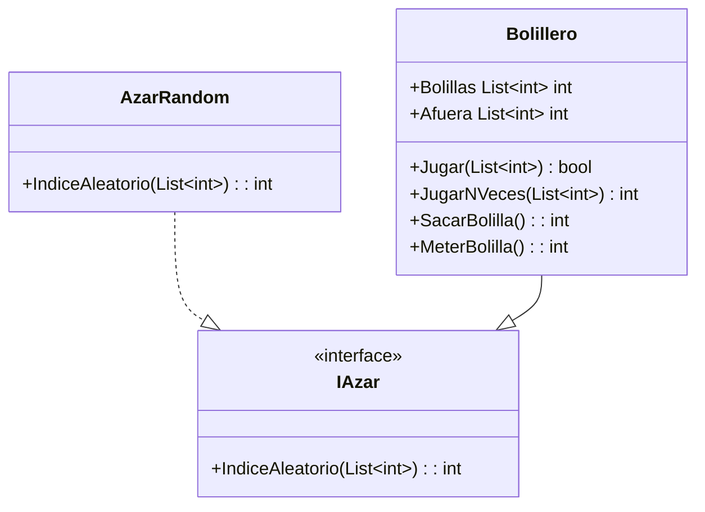

## Documentacion

```mermaid
classDiagram
    class Bolillero{
        +Bolillas List~int~ int
        +Afuera List~int~ int 
        +Jugar (List~int~) bool 
        +JugarNVeces (List~int~) int
        +SacarBolilla(): int
        +MeterBolilla(): int 
    }

    class IAzar{
        <<interface>>
        +IndiceAleatorio(List~int~): int 
    }

    class AzarRandom{
        +IndiceAleatorio(List~int~): int 
    }


AzarRandom ..|> IAzar
Bolillero --|> IAzar

```